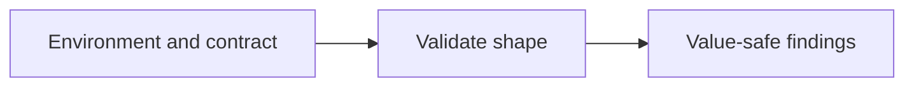

<!-- readme-refresh:start -->
<p align="center">
  <picture>
    <source media="(prefers-color-scheme: dark)" srcset="assets/readme-banner.png">
    <source media="(prefers-color-scheme: light)" srcset="assets/readme-banner.png">
    
  </picture>
</p>

<h1 align="center">📜 Env Contract Kit</h1>

<p align="center"><strong>Validate deployment configuration against a contract without printing values.</strong></p>

<p align="center">
  <a href="https://github.com/al1re3a/env-contract-kit/actions/workflows/ci.yml"></a>
  <a href="https://www.python.org/"></a>
  <a href="LICENSE"></a>
  <a href="https://github.com/al1re3a/env-contract-kit/releases"></a>
  <a href="https://github.com/al1re3a/env-contract-kit/stargazers"></a>
  <a href="https://github.com/al1re3a/env-contract-kit/issues"></a>
</p>

<p align="center">
  <a href="https://github.com/al1re3a/env-contract-kit"></a>
  <a href="#install"></a>
  <a href="CONTRIBUTING.md"></a>
</p>

<p align="center">
  
</p>

> [!NOTE]
> Diagnostics identify variables and rule failures while keeping environment values out of the report.

## 📑 Contents

- [At a glance](#-at-a-glance)
- [What it does](#what-it-does)
- [Install](#install)
- [Quick start](#quick-start)
- [Scope and limitations](#scope-and-limitations)
- [Related work](#related-work)
- [Development and validation](#development-and-validation)

---

## 🔎 At a glance

| | |
|---|---|
| **Purpose** | Catch invalid deployment settings without printing their values. |
| **Input** | Environment and contract |
| **Output** | Value-safe findings |
| **Runtime** | Python 3.11+ |
| **CI** | ✅ Linux · macOS · Windows |
| **Status** | ✅ Maintained |

<details>
<summary><strong>🧭 How it works</strong></summary>



</details>

<details>
<summary><strong>📁 Repository layout</strong></summary>

```text
env-contract-kit/
├── .github/
├── tests/
├── examples/
├── pyproject.toml
├── env_contract_kit.py
└── README.md
```

</details>

<details>
<summary><strong>🤝 Contributors</strong></summary>

<br>
<a href="https://github.com/al1re3a/env-contract-kit/graphs/contributors">
  
</a>

</details>
<!-- readme-refresh:end -->

Catch invalid deployment settings without printing their values.

Small, offline-first command-line software. Version **0.1.0** implements the scope below.
No runtime dependencies beyond Python 3.11+ and its standard library.

## What it does

- TOML contracts: required/optional, empty policy, string/integer/number/boolean/HTTP URL, enum and numeric bounds.
- Duplicate-key and malformed-line rejection; explicit extra-key policy.
- Deterministic JSON reports containing key names and error codes only.

## Install

From a source checkout:

```console
git clone https://github.com/al1re3a/env-contract-kit.git
cd env-contract-kit
python -m pip install .
env-contract-kit --help

# Or run without installing:
python env_contract_kit.py --help
```

No PyPI, package-registry or hosted-release availability is implied by these commands.

## Quick start

Run from the repository root:

```console
python env_contract_kit.py examples/contract.toml examples/development.env
# Exit 0; findings: []
```

JSON goes to stdout; diagnostics go to stderr. Exit status: **0** successful/clean,
**1** findings (where applicable), **2** invalid input or operational error.
Use `--help` for the full CLI contract. Inputs are local files; no telemetry or network calls.

## Scope and limitations

Single-line dotenv assignments only. No interpolation, shell execution, escape decoding or multiline strings. Quotes close at the next matching quote. Booleans are true/false (case-insensitive). Empty values allowed by a rule skip its type/enum checks. URL validation is structural, never a connectivity test. Key names are visible in reports. This is not a secret scanner.

## Related work

[dotenv-linter](https://github.com/dotenv-linter/dotenv-linter) provides dotenv linting, fixes and key diffs.

This project focuses on a checked-in typed contract with bounds and value-free validation output. This is a focused alternative, not a claim of feature superiority or global uniqueness.
Implementation is original; no upstream code was copied.

## Development and validation

```console
python -m unittest discover -s tests -v
```

Local release verification passed **11 unit tests**, package/binary build, installed CLI help, the documented example and a missing-input error path on Windows amd64. See [VALIDATION.txt](VALIDATION.txt) for actual output. CI is configured for
Linux, macOS and Windows; a workflow file is not evidence of a successful hosted run.
Large-scale performance and production integrations have not been validated.

## Contributing

See [CONTRIBUTING.md](CONTRIBUTING.md). Small reproductions and real workflow feedback
are especially useful. See [LAUNCH.md](LAUNCH.md) for an opt-in community introduction plan.

## License and history

MIT; see [LICENSE](LICENSE). Commits use actual creation times. History is not reconstructed
or backdated. Version 0.1.0 is a small complete implementation, not a promise of future features.
